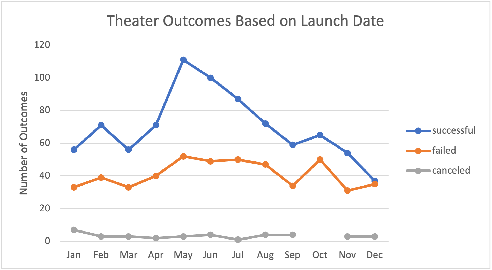
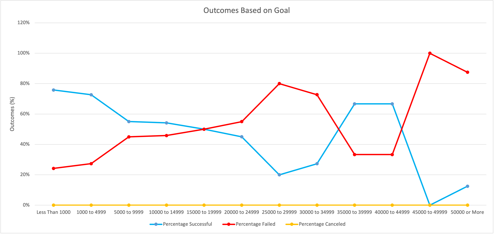

# Kickstarting with Excel

## Overview of Project

**Purpose**: 
To analyze Kickstarter data to help our client (Louise) launch her own Kickstarter campaign, which seeks to bring the play "Fever" to the stage. 
The following deliverables have been requested: (1) Campaign Outcomes Based on Launch Date (2) Campaign Outcomes Based on Funding Goals (3) Conclusions Based on these Data Sets.
[Kickstarter-Analysis](Resources/Kickstarter_Challenge.xlsx.zip)

## Analysis and Challenges 

### Analysis of Outcomes Based on Launch Date
For "Outcomes Based by Launch Date", a pivot table and line chart were generated that compared how outcomes (successful, failed, canceled) differ depending on the campaign launch date. This data was analyzed on a month-by-month basis and includes data from all years. In addition, this data set looks specifically at theater based Kickstarter campaigns.

### Analysis of Outcomes Based on Goals
For "Analysis of Outcomes Based on Goals," the excel "COUNTIFS" function was used to sort the outcomes (successful, failed, canceled) based on the desired financial fundraising goal. This analysis filtered specifically for the subcategory "plays". To facilitate easier analysis of this data, the outcomes based on their respective fundraising goals were expressed as a percentage. 

### Challenges and Difficulties Encountered
During this challenge I was still unfamiliar with using GitHub as a version control system. I realized at one point that there were errors on my spreadsheet due to how I had filtered items from previous analysis. I ended up having to start my analysis over. In the future, version control will be helpful in minimizing the impact of errors such as these.

## Results

### Outcomes Based on Launch Date
The data from  indicate that the number of successful Kickstarter campaigns that theater oriented largely fluctuates based on the month that the campaign was launched. More specifically, successful campaigns are highest in May, June, and July with 111, 100, and 87 successful campaigns respectively. The number of successful campaigns remains below 75 for the rest of the year and reaches a low of 37 in December.

While the number of successful campaigns fluctuates depending on the month they are launched, the number of campaigns that fail or are canceled remain relatively stable regardless of campaign launch date. Together, this data indicates that the best time for Louise to launch her theater Kickstarter campaign is the the month of May and the worst time for her to launch her campaign is in December.  

---

---

### Outcomes Based on Goals
The data from (insert figure here) indicates an inverse relationship exists between Kickstarter campaign success and the campaigns fundraising goal. The data indicates that campaigns with lower fundraising goals have more success, while campaigns with high fundraising goals have lower success. Based on our existing data, I would recommend that Louise set a fundraising goal somewhere between 1,000 - 4,999. 

---

---

### Limitations of Outcomes Based on Goals
It is important to note, that because this data set displays the percentage of success of each outcome it can be misleading when sample sizes are low. At first glance, this graph appears to indicate that the campaigns with fundraising goals between 35,000 - 39,999 and 40,000 - to 44,999 are as successful as campaigns with fundraising goals of less than 1,000 and between 1,000 - 4,999. However, there were only a total of 6 campaigns that had goals ranging from 35,000 - 39,999 and only 3 campaigns that had goals between 40,000 - to 44,999. Conversely, there were 186 campaigns with fundraising goals less than 1,000. In addition, there were 534 campaigns with goals ranging between 1,000 - 4,999. Therefore, we should view the data points between 35,000 - 44,999 skeptically as the sample size is too small to draw accurate conclusions from.

Finally, it is important to note that both figures shown do not filter the data based on the country the campaign was launched in, and therefore cannot accurately indicate the financial value raised by each campaign. For example, 1,000 USD does not equal 1,000 EU. Therefore, it would be prudent to reevaluate these data sets based on the region (or regions) Louise would be interested in launching her campaign. Along those lines, it may also be helpful to determine which countries are most likely to launch successful campaigns in theater and for plays specifically. Additional graphs and charts could be generated to help visualize these based upon Louise's needs.
